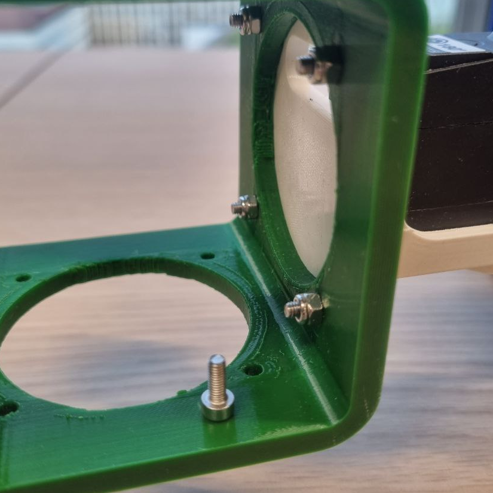
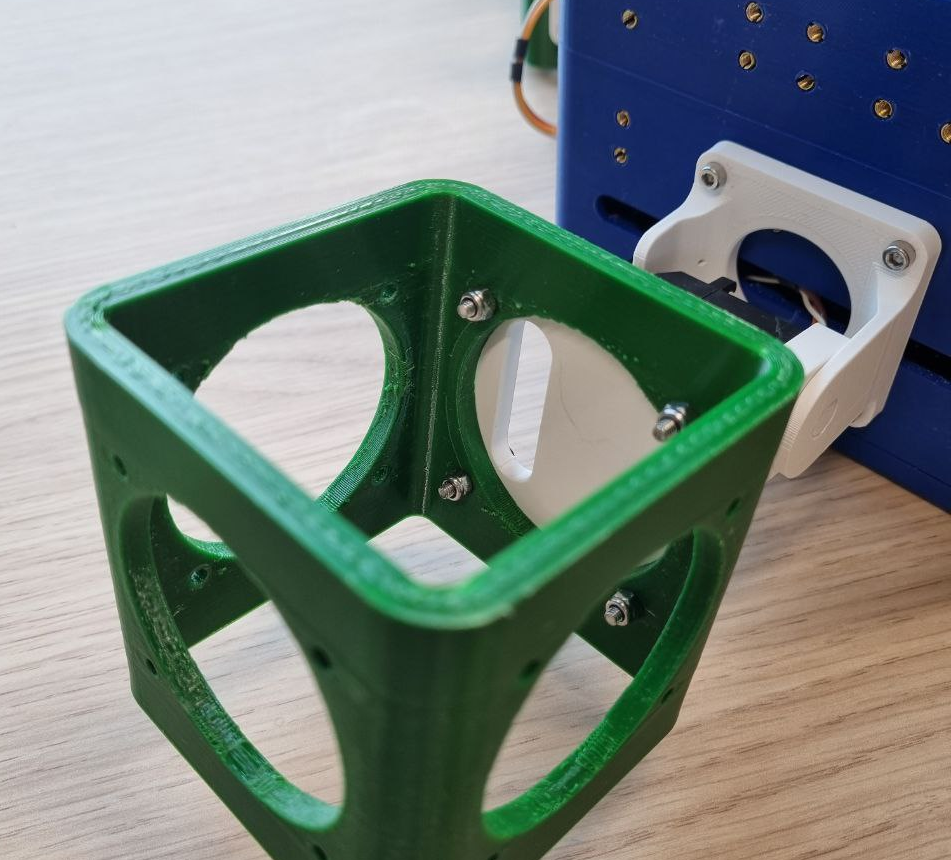
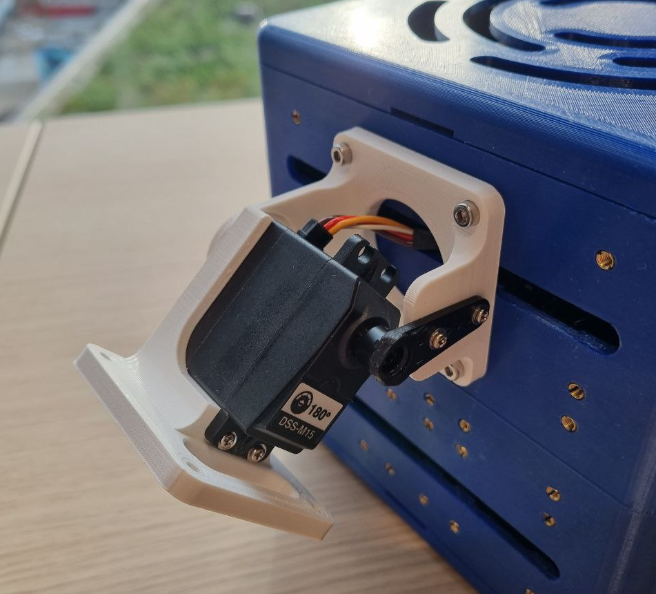
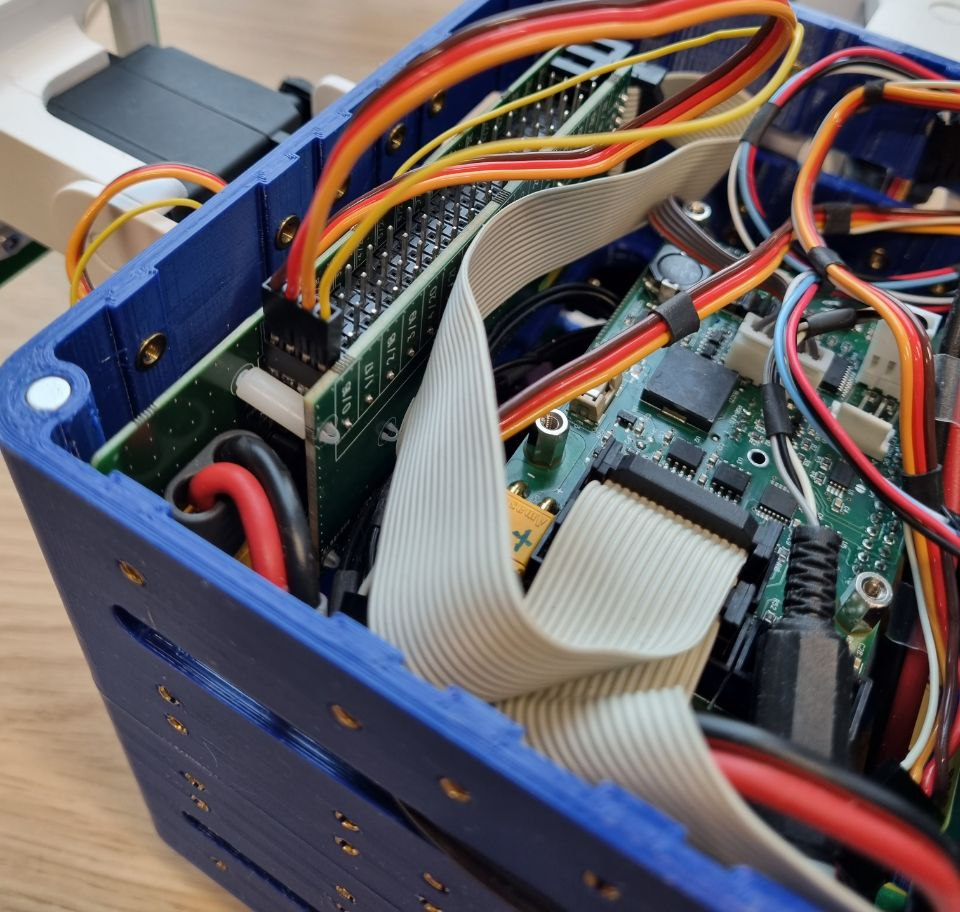
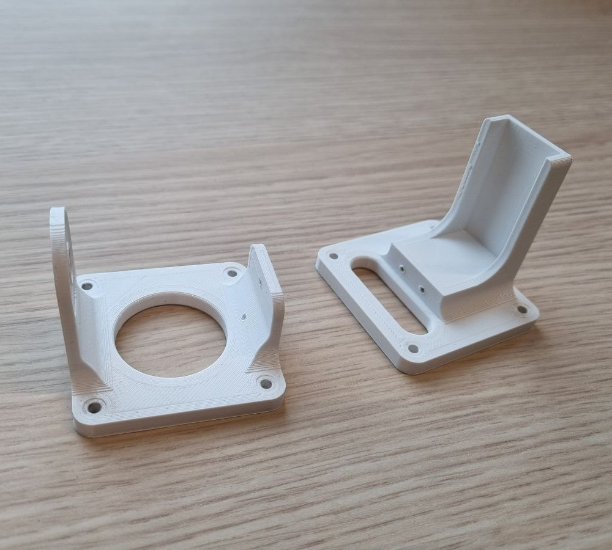
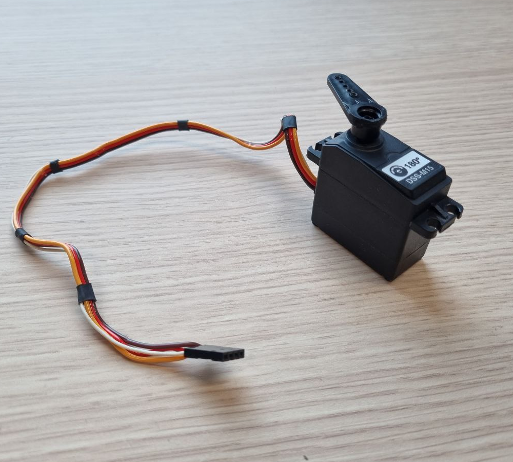
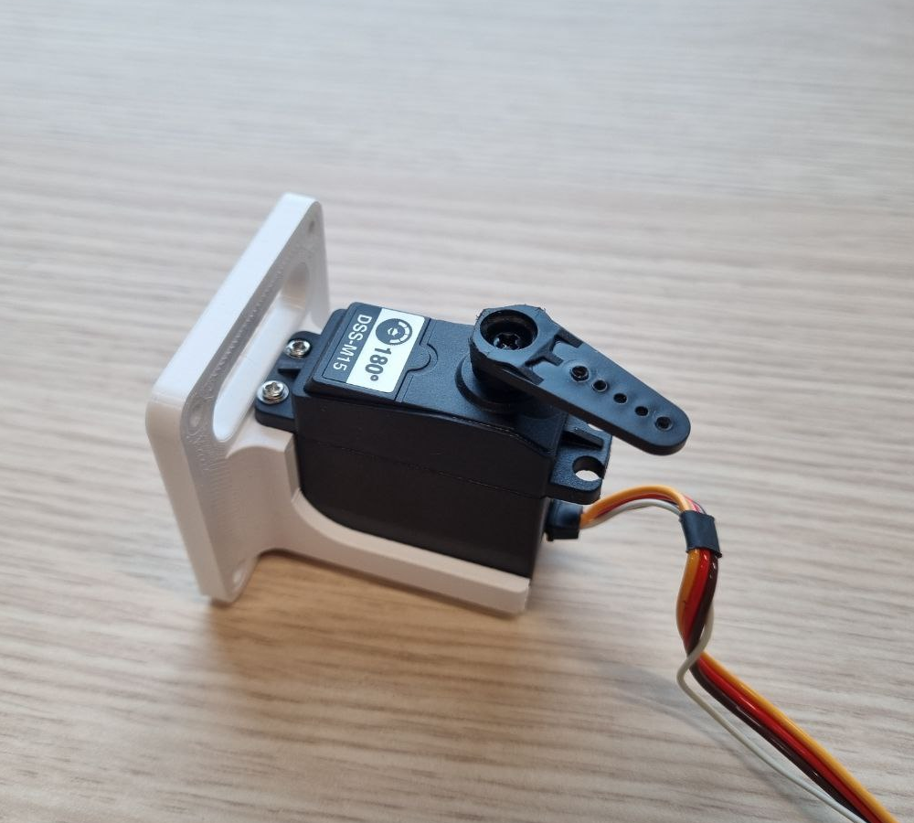
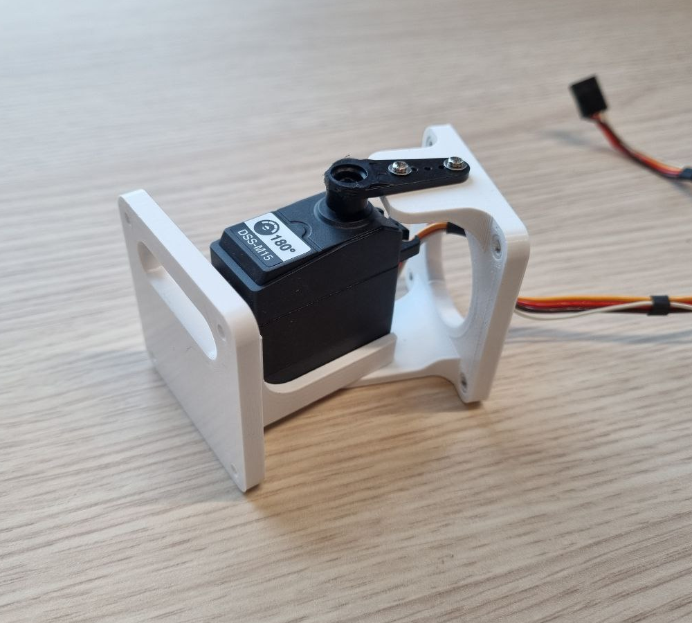
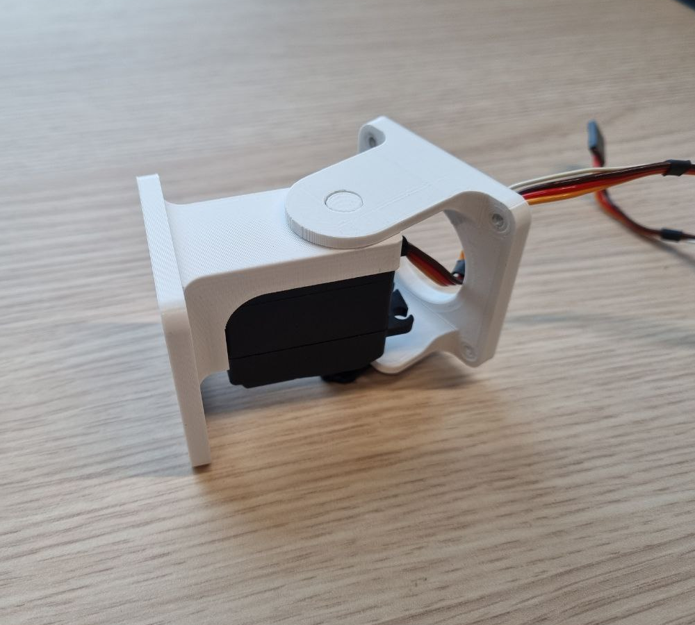

=========================
Creating a physical robot
=========================
This tutorial shows you how to create a physical robot from existing parts.
It assumes you understand the concept of a modular robot and its modules.
The guide is only for V2 modular robots. V1 modular robots are legacy and only to be used within CI Group. If you are from that group, ask around.

--------------
Required parts
--------------

The core module
===============

.. image:: ../core.png
  :width: 400
  :alt: A core module

A working core module is required.
Ask around your research group if a core is readily available.
If you are a maintainer of your research group, :ref:`take a look at the guide on how to create a core module<physical_robot_core_setup/index:Setting up a new modular robot core>`.

Brick and active hinge modules
==============================

.. image:: ../isotropic_brick.png
   :width: 45%
.. image:: ../active_hinge.png
   :width: 45%

Ask around your research group if brick (isotropic) and hinge modules are readily available.
If not, see :ref:`creating_a_physical_robot/index:3D printing and assembling modules`.

Bolts for attaching modules
============================

There are two types of bolts. Both are Torx 10.
The bolts connecting modules to the core are 8mm long, whereas the bolts connecting two non-core modules are 20mm long and require matching nuts.

--------------------------
Assembling a modular robot
--------------------------

Modules are connect by bolting them together. See the photo above as an example.
Note that when connecting to the core nuts are not required as thread is embedded in the core.
Route the wires from the active hinges into the core and plug them in as displayed on the photo.
Make sure the ground (dark) wire is oriented correctly.
Note the numbers of the pins you attach your active hinges to. These will be used later when controlling the robot.

Try to connect the active hinges to pins that are far apart. Nearby pins run on the same power management system which can be a problem when hinges draw too much power leading to a power failure and stuttering movement.

----------------------------------
3D printing and assembling modules
----------------------------------
Bricks and active hinges can be 3D printed using the files at `<https://github.com/ci-group/revolve-models/tree/master/v2>`_.
If you are working in a research group that is already using Revolve2, this step is probably not necessary and modules are already available.

To actuate your robot, we have provided a sufficient number of servos for students and researchers. The servo model is DSS-M15, and the exact specifications can be found at `<https://w3.icshop.com.tw/pd/368040600012/datasheet.pdf>`_.
We offer three servo cable lengths—55cm, 70cm, and 95cm—depending on your robot's design.
Choose the appropriate length accordingly. The servos have been modified by our electronics lab to include angle readout functionality.
Please note that if you are not part of our research group, you will need a way to read the current position of the servo or physically
modify the servo to enable this feature, which is often possible.
To assemble an active hinge you will need screws. These will either come with the bought servo, or you have to find matching ones.

-------------------------
Using your physical robot
-------------------------
The `physical_robot_remote` :ref:`example<getting_started/index:Step 2: Play with the examples>` will show you how to control your newly built physical robot.
