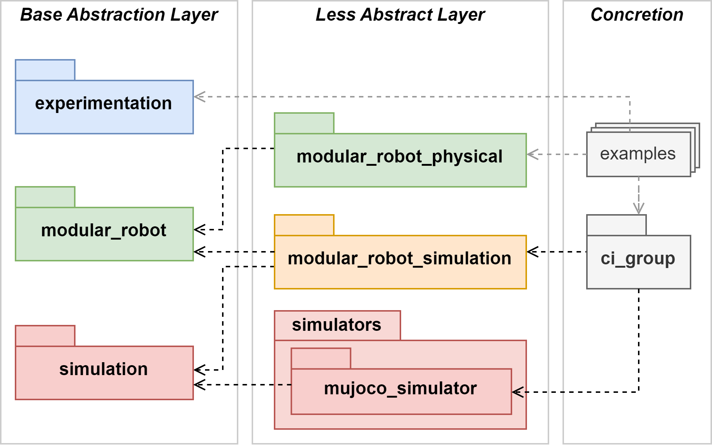

======================
Revolve2 documentation
======================

Revolve2 is a collection of Python packages used for researching evolutionary algorithms and modular robotics.
Its primary features are a modular robot framework, an abstraction layer around physics simulators, and evolutionary algorithms.
The structure of the packages in Revolve2 is as follows:

Revolve2's code resides at `<https://github.com/ci-group/revolve2>`_.

.. toctree::
   :maxdepth: 2

   Getting Started <getting_started/index>
   Installation <installation/index>
   Introduction to modular robots <introduction_to_modular_robots/index>
   Creating a physical robot <creating_a_physical_robot/index>
   Physical Robot Core Setup <physical_robot_core_setup/index>
   Contributing guide <contributing_guide/index>