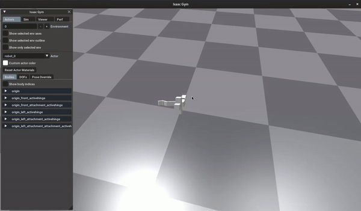
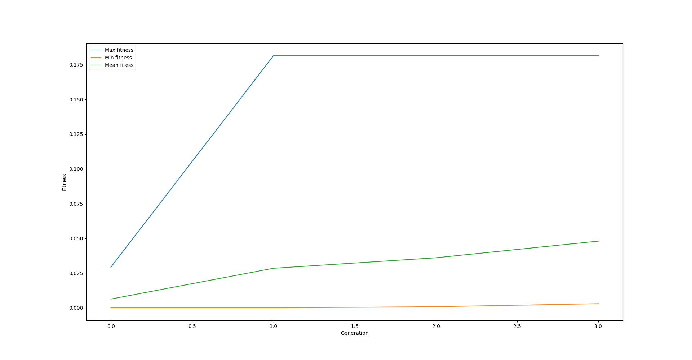

=====================================================================
Optimizing a modular robot for locomotion using CPPNWIN and Isaac Gym
=====================================================================
The final results of this tutorial are available at ``<revolve2_source>/examples/optimize_modular>``.

-------------------
What you will learn
-------------------

* How to use the ``CPPNWIN`` genotype supplementary package.
* How to combine modular robots with evolutionary optimization.
* How to manually insert into a database.

-------------
Prerequisites
-------------

* Tutorial :ref:`tutorials/simple_optimization:A simple optimization process with a database`
* Tutorial :ref:`tutorials/simulate_robot_isaac:Creating a modular robot and simulating and visualizing it in the Isaac Gym environment`
* Have the supplementary package ``genotype CPPNWIN`` :ref:`installed <installation/genotypes/cppnwin:CPPNWIN genotype>`.
* Superficial knowledge of the CPPNWIN genotype, used by ci-group.

------------
Introduction
------------
You will create a program that optimizes a modular robot body and brain for undirected locomotion.
That is, a robot that moves as far as possible, no matter the direction.

--------------
Programming it
--------------
The code you will write is incrediby similar to the ``simple optimization`` tutorial. As with that tutorial it will be convenient to seperate your code in multiple files.
Create an empty directory and a file ``optimize.py``. This will be your program's entry point.
The baseline code for this program is similar to the previous tutorials'::

    # optimize.py

    import logging
    from random import Random
    from revolve2.core.database.sqlite import Database as DbSqlite

    async def main():
        POPULATION_SIZE = 10
        OFFSPRING_SIZE = 10
        NUM_GENERATIONS = 3

        logging.basicConfig(
            level=logging.INFO,
            format="[%(asctime)s] [%(levelname)s] [%(module)s] %(message)s",
        )

        logging.info(f"Starting optimization")

        # random number generator
        rng = Random()
        rng.seed(100)

        # database
        database = await DbSqlite.create(f"database")

        # here you will add your initial population and optimizer later
        # ...

        logging.info("Starting optimization process..")

        # await ep.run()

        logging.info(f"Finished optimizing.")

    if __name__ == "__main__":
        import asyncio

        asyncio.run(main())

~~~~~~~~~~~~
The genotype
~~~~~~~~~~~~

Start by creating a genotype in a new file called ``genotype.py``.
Let it be the composite of a body and brain genotype, both of type ``CPPNWIN``, which is a genotype provided by Revolve2.
The library also provides a serializer for the CPPNWIN genotype, so creating a serializer for the composite genotype should be trivial::

    # genotype.py

    from dataclasses import dataclass
    from revolve2.genotypes.cppnwin import (
        Genotype as CppnwinGenotype,
        GenotypeSerializer as CppnwinGenotypeSerializer,
    )
    from revolve2.core.database import Serializer, IncompatibleError
    from sqlalchemy.ext.asyncio.session import AsyncSession
    from sqlalchemy.ext.declarative import declarative_base
    from sqlalchemy.future import select
    import sqlalchemy
    from typing import List

    @dataclass
    class Genotype:
        body: CppnwinGenotype
        brain: CppnwinGenotype

    class GenotypeSerializer(Serializer[Genotype]):
        @classmethod
        async def create_tables(cls, session: AsyncSession) -> None:
            await (await session.connection()).run_sync(DbBase.metadata.create_all)
            await CppnwinGenotypeSerializer.create_tables(session)

        @classmethod
        def identifying_table(cls) -> str:
            return DbGenotype.__tablename__

        @classmethod
        async def to_database(
            cls, session: AsyncSession, objects: List[Genotype]
        ) -> List[int]:
            body_ids = await CppnwinGenotypeSerializer.to_database(
                session, [o.body for o in objects]
            )
            brain_ids = await CppnwinGenotypeSerializer.to_database(
                session, [o.brain for o in objects]
            )

            dbgenotypes = [
                DbGenotype(body_id=body_id, brain_id=brain_id)
                for body_id, brain_id in zip(body_ids, brain_ids)
            ]

            session.add_all(dbgenotypes)
            await session.flush()
            ids = [
                dbfitness.id for dbfitness in dbgenotypes if dbfitness.id is not None
            ]  # cannot be none because not nullable. check if only there to silence mypy.
            assert len(ids) == len(objects)  # but check just to be sure
            return ids

        @classmethod
        async def from_database(
            cls, session: AsyncSession, ids: List[int]
        ) -> List[Genotype]:
            rows = (
                (await session.execute(select(DbGenotype).filter(DbGenotype.id.in_(ids))))
                .scalars()
                .all()
            )

            if len(rows) != len(ids):
                raise IncompatibleError()

            id_map = {t.id: t for t in rows}
            body_ids = [id_map[id].body_id for id in ids]
            brain_ids = [id_map[id].brain_id for id in ids]

            body_genotypes = await CppnwinGenotypeSerializer.from_database(
                session, body_ids
            )
            brain_genotypes = await CppnwinGenotypeSerializer.from_database(
                session, brain_ids
            )

            genotypes = [
                Genotype(body, brain)
                for body, brain in zip(body_genotypes, brain_genotypes)
            ]

            return genotypes

    DbBase = declarative_base()

    class DbGenotype(DbBase):
        __tablename__ = "genotype"

        id = sqlalchemy.Column(
            sqlalchemy.Integer,
            nullable=False,
            unique=True,
            autoincrement=True,
            primary_key=True,
        )

        body_id = sqlalchemy.Column(sqlalchemy.Integer, nullable=False)
        brain_id = sqlalchemy.Column(sqlalchemy.Integer, nullable=False)

For the random initialization of the genotype you need to dive into ``MultiNEAT``.
MultiNEAT is the C++ implementation behind CPPNWIN.
You need to interact with this library because you need to determine the parameters used for creating the CPPN network,
and because you need to create a random object that MultiNEAT understand.
The latter is easy, as you can simply instantiate a MultiNEAT random object and seed it with a random integer obtained from the Python random object.
The MultiNEAT ``parameters`` are more complex, but this tutorial will give you a starting point. For more options refer to the MultiNEAT documentation.
You also need parameters for the MultiNEAT innovation databases, one for body and one for brain::

    import multineat
    from random import Random
    from revolve2.genotypes.cppnwin.modular_robot.body_genotype_v1 import (
        random_v1 as body_random,
    )
    from revolve2.genotypes.cppnwin.modular_robot.brain_genotype_cpg_v1 import (
        random_v1 as brain_random,
    )

    # ...

    def random(
        innov_db_body: multineat.InnovationDatabase,
        innov_db_brain: multineat.InnovationDatabase,
        rng: Random,
        num_initial_mutations: int,
    ) -> Genotype:
        multineat_rng = _multineat_rng_from_random(rng)

        body = body_random(
            innov_db_body,
            multineat_rng,
            _MULTINEAT_PARAMS,
            multineat.ActivationFunction.TANH,
            num_initial_mutations,
        )

        brain = brain_random(
            innov_db_brain,
            multineat_rng,
            _MULTINEAT_PARAMS,
            multineat.ActivationFunction.SIGNED_SINE,
            num_initial_mutations,
        )

        return Genotype(body, brain)

    def _multineat_rng_from_random(rng: Random) -> multineat.RNG:
        multineat_rng = multineat.RNG()
        multineat_rng.Seed(rng.randint(0, 2**31))
        return multineat_rng

    def _make_multineat_params() -> multineat.Parameters:
        multineat_params = multineat.Parameters()

        multineat_params.MutateRemLinkProb = 0.02
        multineat_params.RecurrentProb = 0.0
        multineat_params.OverallMutationRate = 0.15
        multineat_params.MutateAddLinkProb = 0.08
        multineat_params.MutateAddNeuronProb = 0.01
        multineat_params.MutateWeightsProb = 0.90
        multineat_params.MaxWeight = 8.0
        multineat_params.WeightMutationMaxPower = 0.2
        multineat_params.WeightReplacementMaxPower = 1.0
        multineat_params.MutateActivationAProb = 0.0
        multineat_params.ActivationAMutationMaxPower = 0.5
        multineat_params.MinActivationA = 0.05
        multineat_params.MaxActivationA = 6.0

        multineat_params.MutateNeuronActivationTypeProb = 0.03

        multineat_params.MutateOutputActivationFunction = False

        multineat_params.ActivationFunction_SignedSigmoid_Prob = 0.0
        multineat_params.ActivationFunction_UnsignedSigmoid_Prob = 0.0
        multineat_params.ActivationFunction_Tanh_Prob = 1.0
        multineat_params.ActivationFunction_TanhCubic_Prob = 0.0
        multineat_params.ActivationFunction_SignedStep_Prob = 1.0
        multineat_params.ActivationFunction_UnsignedStep_Prob = 0.0
        multineat_params.ActivationFunction_SignedGauss_Prob = 1.0
        multineat_params.ActivationFunction_UnsignedGauss_Prob = 0.0
        multineat_params.ActivationFunction_Abs_Prob = 0.0
        multineat_params.ActivationFunction_SignedSine_Prob = 1.0
        multineat_params.ActivationFunction_UnsignedSine_Prob = 0.0
        multineat_params.ActivationFunction_Linear_Prob = 1.0

        multineat_params.MutateNeuronTraitsProb = 0.0
        multineat_params.MutateLinkTraitsProb = 0.0

        multineat_params.AllowLoops = False

        return multineat_params

    _MULTINEAT_PARAMS = _make_multineat_params()

Mutation is straightforward. Create a new instance of your ``Genotype`` class and use the ``mutate`` functions on your body and brain genotypes::

    from revolve2.genotypes.cppnwin import mutate_v1

    # ...

    def mutate(
        genotype: Genotype,
        innov_db_body: multineat.InnovationDatabase,
        innov_db_brain: multineat.InnovationDatabase,
        rng: Random,
    ) -> Genotype:
        multineat_rng = _multineat_rng_from_random(rng)

        return Genotype(
            mutate_v1(genotype.body, _MULTINEAT_PARAMS, innov_db_body, multineat_rng),
            mutate_v1(genotype.brain, _MULTINEAT_PARAMS, innov_db_brain, multineat_rng),
        )

Crossover is very similar. The CPNNWIN crossover function takes some extra parameters that are irrelevant for now. Take a look at the documentation if you are interested::

    from revolve2.genotypes.cppnwin import crossover_v1

    def crossover(
        parent1: Genotype,
        parent2: Genotype,
        rng: Random,
    ) -> Genotype:
        multineat_rng = _multineat_rng_from_random(rng)

        return Genotype(
            crossover_v1(
                parent1.body,
                parent2.body,
                _MULTINEAT_PARAMS,
                multineat_rng,
                False,
                False,
            ),
            crossover_v1(
                parent1.brain,
                parent2.brain,
                _MULTINEAT_PARAMS,
                multineat_rng,
                False,
                False,
            ),
        )

Development into a ``ModularRobot`` is readily available in Revolve2::

    from revolve2.genotypes.cppnwin.modular_robot.body_genotype_v1 import (
        develop_v1 as body_develop,
    )
    from revolve2.genotypes.cppnwin.modular_robot.brain_genotype_cpg_v1 import (
        develop_v1 as brain_develop,
    )
    from revolve2.core.modular_robot import ModularRobot

    # ...

    def develop(genotype: Genotype) -> ModularRobot:
        body = body_develop(genotype.body)
        brain = brain_develop(genotype.brain, body)
        return ModularRobot(body, brain)

~~~~~~~~~~~~~
The optimizer
~~~~~~~~~~~~~
The optimizer will look similar to the optimizer from the previous evolutionary optimization tutorial.
Add the innovation databases, as they will be shared between all genotypes.
Additionally, instead of a single controller you will store a controller for each individual robot.
Finally, you can save some of the parameters provided to ``ainit_new`` in the database so they don't have to be provided again when loading from the database::

    # optimizer.py

    import pickle
    from random import Random
    from typing import List, Tuple

    import multineat
    from genotype import Genotype, GenotypeSerializer
    from sqlalchemy.ext.declarative import declarative_base
    import sqlalchemy
    from sqlalchemy.ext.asyncio import AsyncEngine
    from sqlalchemy.ext.asyncio.session import AsyncSession
    from sqlalchemy.future import select

    import revolve2.core.optimization.ea.generic_ea.population_management as population_management
    import revolve2.core.optimization.ea.generic_ea.selection as selection
    from revolve2.actor_controller import ActorController
    from revolve2.core.database import IncompatibleError
    from revolve2.core.database.serializers import FloatSerializer
    from revolve2.core.optimization import DbId
    from revolve2.core.optimization.ea.generic_ea import EAOptimizer
    from revolve2.core.physics.running import (
        ActorControl,
        Runner,
    )
    from revolve2.runners.mujoco import LocalRunner

    class Optimizer(EAOptimizer[Genotype, float]):
        _db_id: DbId

        _runner: Runner

        _controllers: List[ActorController]

        _innov_db_body: multineat.InnovationDatabase
        _innov_db_brain: multineat.InnovationDatabase

        _rng: Random

        _simulation_time: int
        _sampling_frequency: float
        _control_frequency: float

        _num_generations: int

        async def ainit_new(
            self,
            database: AsyncEngine,
            session: AsyncSession,
            db_id: DbId,
            initial_population: List[Genotype],
            rng: Random,
            innov_db_body: multineat.InnovationDatabase,
            innov_db_brain: multineat.InnovationDatabase,
            simulation_time: int,
            sampling_frequency: float,
            control_frequency: float,
            num_generations: int,
            offspring_size: int,
        ) -> None:
            await super().ainit_new(
                database=database,
                session=session,
                db_id=db_id,
                genotype_type=Genotype,
                genotype_serializer=GenotypeSerializer,
                fitness_type=float,
                fitness_serializer=FloatSerializer,
                offspring_size=offspring_size,
                initial_population=initial_population,
            )

            self._db_id = db_id
            self._init_runner()
            self._innov_db_body = innov_db_body
            self._innov_db_brain = innov_db_brain
            self._rng = rng
            self._simulation_time = simulation_time
            self._sampling_frequency = sampling_frequency
            self._control_frequency = control_frequency
            self._num_generations = num_generations

            # create database structure if not exists
            await (await session.connection()).run_sync(DbBase.metadata.create_all)

            # save to database
            self._on_generation_checkpoint(session)

        async def ainit_from_database(
            self,
            database: AsyncEngine,
            session: AsyncSession,
            db_id: DbId,
            rng: Random,
            innov_db_body: multineat.InnovationDatabase,
            innov_db_brain: multineat.InnovationDatabase,
        ) -> bool:
            if not await super().ainit_from_database(
                database=database,
                session=session,
                db_id=db_id,
                genotype_type=Genotype,
                genotype_serializer=GenotypeSerializer,
                fitness_type=float,
                fitness_serializer=FloatSerializer,
            ):
                return False

            self._db_id = db_id
            self._init_runner()

            opt_row = (
                (
                    await session.execute(
                        select(DbOptimizerState)
                        .filter(DbOptimizerState.db_id == self._db_id.fullname)
                        .order_by(DbOptimizerState.generation_index.desc())
                    )
                )
                .scalars()
                .first()
            )

            # if this happens something is wrong with the database
            if opt_row is None:
                raise IncompatibleError

            self._simulation_time = opt_row.simulation_time
            self._sampling_frequency = opt_row.sampling_frequency
            self._control_frequency = opt_row.control_frequency
            self._num_generations = opt_row.num_generations

            self._rng = rng
            self._rng.setstate(pickle.loads(opt_row.rng))

            self._innov_db_body = innov_db_body
            self._innov_db_body.Deserialize(opt_row.innov_db_body)
            self._innov_db_brain = innov_db_brain
            self._innov_db_brain.Deserialize(opt_row.innov_db_brain)

            return True

        def _init_runner(self) -> None:
            self._runner = LocalRunner(headless=True)

        def _select_parents(
            self,
            population: List[Genotype],
            fitnesses: List[float],
            num_parent_groups: int,
        ) -> List[List[int]]:
            return [
                selection.multiple_unique(
                    2,
                    population,
                    fitnesses,
                    lambda _, fitnesses: selection.tournament(self._rng, fitnesses, k=2),
                )
                for _ in range(num_parent_groups)
            ]

        def _select_survivors(
            self,
            old_individuals: List[Genotype],
            old_fitnesses: List[float],
            new_individuals: List[Genotype],
            new_fitnesses: List[float],
            num_survivors: int,
        ) -> Tuple[List[int], List[int]]:
            assert len(old_individuals) == num_survivors

            return population_management.steady_state(
                old_individuals,
                old_fitnesses,
                new_individuals,
                new_fitnesses,
                lambda _, fitnesses: selection.tournament(self._rng, fitnesses, k=2),
            )

        def _must_do_next_gen(self) -> bool:
            return self.generation_index != self._num_generations

        def _on_generation_checkpoint(self, session: AsyncSession) -> None:
            session.add(
                DbOptimizerState(
                    db_id=self._db_id.fullname,
                    generation_index=self.generation_index,
                    rng=pickle.dumps(self._rng.getstate()),
                    innov_db_body=self._innov_db_body.Serialize(),
                    innov_db_brain=self._innov_db_brain.Serialize(),
                    simulation_time=self._simulation_time,
                    sampling_frequency=self._sampling_frequency,
                    control_frequency=self._control_frequency,
                    num_generations=self._num_generations,
                )
            )

        def _crossover(self, parents: List[Genotype]) -> Genotype:
            raise NotImplementedError()

        def _mutate(self, genotype: Genotype) -> Genotype:
            raise NotImplementedError()

        async def _evaluate_generation(
            self,
            genotypes: List[Genotype],
            database: AsyncEngine,
            db_id: DbId,
        ) -> List[float]:
            raise NotImplementedError()

        def _control(self, environment_index: int, dt: float, control: ActorControl) -> None:
            raise NotImplementedError()

    DbBase = declarative_base()

    class DbOptimizerState(DbBase):
        __tablename__ = "optimizer"

        db_id = sqlalchemy.Column(
            sqlalchemy.String,
            nullable=False,
            primary_key=True,
        )
        generation_index = sqlalchemy.Column(
            sqlalchemy.Integer, nullable=False, primary_key=True
        )
        rng = sqlalchemy.Column(sqlalchemy.PickleType, nullable=False)
        innov_db_body = sqlalchemy.Column(sqlalchemy.String, nullable=False)
        innov_db_brain = sqlalchemy.Column(sqlalchemy.String, nullable=False)
        simulation_time = sqlalchemy.Column(sqlalchemy.Integer, nullable=False)
        sampling_frequency = sqlalchemy.Column(sqlalchemy.Float, nullable=False)
        control_frequency = sqlalchemy.Column(sqlalchemy.Float, nullable=False)
        num_generations = sqlalchemy.Column(sqlalchemy.Integer, nullable=False)

``crossover`` and ``mutate`` can use the functions defined in your ``Genotype``::

    from genotype import crossover, mutate

    # ...

    def _crossover(self, parents: List[Genotype]) -> Genotype:
        assert len(parents) == 2
        return crossover(parents[0], parents[1], self._rng)

    def _mutate(self, genotype: Genotype) -> Genotype:
        return mutate(genotype, self._innov_db_body, self._innov_db_brain, self._rng)

Evaluation works similar to the simulator created in the previous Isaac Gym environment tutorial, with two small differences.
Firstly, there are multiple robots. Store the controllers in their array and call all of them in the control function.
Secondly, the robots have unpredicatable bodies, so use the modular robot's built-in axis aligned bounding box(aabb) function to find out how high off the ground you need to position it.
And lastly, calculate and return the fitness of the robot, based on the simulation history.::

    from revolve2.runners.mujoco import LocalRunner
    from revolve2.core.physics.running import Batch, Environment, PosedActor, ActorState
    from genotype import develop
    from pyrr import Vector3, Quaternion

    # ...

    async def _evaluate_generation(
        self,
        genotypes: List[Genotype],
        database: AsyncEngine,
        db_id: DbId,
    ) -> List[float]:
        batch = Batch(
            simulation_time=self._simulation_time,
            sampling_frequency=self._sampling_frequency,
            control_frequency=self._control_frequency,
            control=self._control,
        )

        self._controllers = []

        for genotype in genotypes:
            actor, controller = develop(genotype).make_actor_and_controller()
            bounding_box = actor.calc_aabb()
            self._controllers.append(controller)
            env = Environment()
            env.actors.append(
                PosedActor(
                    actor,
                    Vector3(
                        [
                            0.0,
                            0.0,
                            bounding_box.size.z / 2.0 - bounding_box.offset.z,
                        ]
                    ),
                    Quaternion(),
                    [0.0 for _ in controller.get_dof_targets()],
                )
            )
            batch.environments.append(env)

        batch_results = await self._runner.run_batch(batch)

        return [
            self._calculate_fitness(
                environment_result.environment_states[0].actor_states[0],
                environment_result.environment_states[-1].actor_states[0],
            )
            for environment_result in batch_results.environment_results
        ]

    def _control(self, environment_index: int, dt: float, control: ActorControl) -> None:
        controller = self._controllers[environment_index]
        controller.step(dt)
        control.set_dof_targets(0, controller.get_dof_targets())

    @staticmethod
    def _calculate_fitness(begin_state: ActorState, end_state: ActorState) -> float:
        raise NotImplementedError()

The last thing you have to do is write the fitness function.
This tutorial simply uses the distance traveled on the xy plane::

    import math

    # ...

    @staticmethod
    def _calculate_fitness(begin_state: ActorState, end_state: ActorState) -> float:
        # distance traveled on the xy plane
        return float(
            math.sqrt(
                (begin_state.position[0] - end_state.position[0]) ** 2
                + ((begin_state.position[1] - end_state.position[1]) ** 2)
            )
        )

~~~~~~~~~~~~~~~~~~~~~~~~~~~~
Adding the optimizer to main
~~~~~~~~~~~~~~~~~~~~~~~~~~~~
You can now add the finished optimizer to your ``main`` function.
You will also need to add some extra constants.::

    # optimize.py

    import multineat
    from revolve2.core.optimization import DbId
    from genotype import random as random_genotype
    from optimizer import Optimizer

    # ...

    async def main():
        # number of initial mutations for body and brain CPPNWIN networks
        NUM_INITIAL_MUTATIONS = 10

        SIMULATION_TIME = 10
        SAMPLING_FREQUENCY = 60
        CONTROL_FREQUENCY = 5

        # ...

        # unique database identifier for optimizer
        db_id = DbId.root("optmodular")

        # multineat innovation databases
        innov_db_body = multineat.InnovationDatabase()
        innov_db_brain = multineat.InnovationDatabase()

        initial_population = [
            random_genotype(innov_db_body, innov_db_brain, rng, NUM_INITIAL_MUTATIONS)
            for _ in range(POPULATION_SIZE)
        ]

        maybe_optimizer = await Optimizer.from_database(
            database=database,
            db_id=db_id,
            innov_db_body=innov_db_body,
            innov_db_brain=innov_db_brain,
            rng=rng,
        )
        if maybe_optimizer is not None:
            optimizer = maybe_optimizer
        else:
            optimizer = await Optimizer.new(
                database=database,
                db_id=db_id,
                initial_population=initial_population,
                rng=rng,
                innov_db_body=innov_db_body,
                innov_db_brain=innov_db_brain,
                simulation_time=SIMULATION_TIME,
                sampling_frequency=SAMPLING_FREQUENCY,
                control_frequency=CONTROL_FREQUENCY,
                num_generations=NUM_GENERATIONS,
                offspring_size=OFFSPRING_SIZE,
            )

        logging.info("Starting optimization process..")

        await optimizer.run()

        logging.info(f"Finished optimizing.")

    # ...

---------------------
Running and analyzing
---------------------
Run ``optimize.py`` and your robots will evolve.
Depending on your parameters this can take quite a long time.
The example parameters used in this example will result in a fast optimization process but yield bad robots.
To actually see the robots you can set ``headless=False`` in your optimizer when creating the runner.

You can analyze the results using the same scripts as from the previous optimization tutorial.
Depending on your evolution parameters and the parameters provided to the plotting script it will look similar to::

    revolve2_plot_ea_fitness_float ./database 0

---------
Rerunning
---------
Using the ``ModularRobotRerunner`` from the previous Isaac Gym tutorial you can visualize your best robot.
The script below selects the best robot from the database and lets it walk::

    # rerun_best.py

    from genotype import GenotypeSerializer, develop
    from revolve2.runners.mujoco import ModularRobotRerunner
    from sqlalchemy.ext.asyncio.session import AsyncSession
    from sqlalchemy.future import select

    from revolve2.core.database import open_async_database_sqlite
    from revolve2.core.database.serializers import DbFloat
    from revolve2.core.optimization.ea.generic_ea import DbEAOptimizerIndividual

    async def main() -> None:

        db = open_async_database_sqlite("./database", create=True)
        async with AsyncSession(db) as session:
            best_individual = (
                await session.execute(
                    select(DbEAOptimizerIndividual, DbFloat)
                    .filter(DbEAOptimizerIndividual.fitness_id == DbFloat.id)
                    .order_by(DbFloat.value.desc())
                )
            ).first()

            assert best_individual is not None

            print(f"fitness: {best_individual[1].value}")

            genotype = (
                await GenotypeSerializer.from_database(
                    session, [best_individual[0].genotype_id]
                )
            )[0]

        rerunner = ModularRobotRerunner()
        await rerunner.rerun(develop(genotype), 5)

    if __name__ == "__main__":
        import asyncio

        asyncio.run(main())

------------
Contributing
------------
This marks the end of this tutorial. Feedback and contributions are welcome at Revolve2's code repository.
