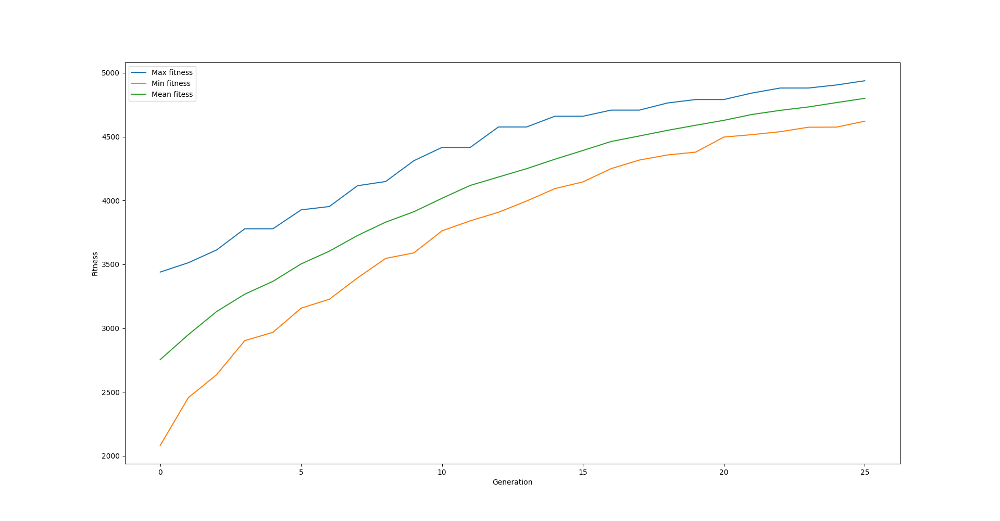

=============================================
A simple optimization process with a database
=============================================
The final results of this tutorial are available at ``<revolve2_source>/examples/simple_optimization>``.

-------------------
What you will learn
-------------------

* How to use the ``EvolutionaryOptimizer``.
* How to use the ``Database``.

-------------
Prerequisites
-------------

* Have Revolve2 :ref:`installed <installation/index:Installation>`.
* No supplementary libraries are required.
* Basic knowledge of evolutionary computing.

------------
Introduction
------------
You are going to create an evolutionary optimization process that can find a good solution to the `knapsack problem <https://en.wikipedia.org/wiki/Knapsack_problem>`_.
See also chapter 2.4.2 of `<https://www.cs.vu.nl/~gusz/ecbook/Eiben-Smith-Intro2EC-Ch2.pdf>`_.
The problem is as follows: given a set of items, each with a weight and a value, determine the items to include in a collection so that the total weight is less than or equal to a given limit and the total value is as large as possible.

The phenotype of a solution to the problem will be represented by a binary string.
Every bit corresponds to an item that can be included in the knapsack.
A one means the item is included, and a zero means it is not.
Naturally the sum of the weights of all items must be no larger than the maximum weight.
A genotype follows the same structure, but without the weight restriction.
The function from genotype to phenotype simply adds items from left to right in the bit string, skipping any items that would bring the weight over the maximum.

The crossover operator will choose a random point along the bit string. All bits before that point will be taken taken from parent one and the rest from parent two.
The mutation operator will randomly flip each bit with 1/*n* chance, with *n* being the length of the bit strings.

--------------
Programming it
--------------
Start by creating a file called ``item.py``. To represent an item, create a class ``Item`` that contains a ``weight`` and a ``value``::

    # item.py

    from dataclasses import dataclass

    @dataclass
    class Item:
        weight: float
        value: float

Next, create a class phenotype in ``phenotype.py``. This class is simply a list of booleans::

    # phenotype.py

    from typing import List
    from dataclasses import dataclass

    @dataclass
    class Phenotype():
        items: List[bool]

The genotype is more complex. The class is also a list of booleans, but it comes with some methods.
Firstly, a ``random`` function that creates a random genotype, and secondly, a ``develop`` function that creates a phenotype from the genotype::

    # genotype.py

    from dataclasses import dataclass
    from random import Random
    from typing import List

    from item import Item
    from phenotype import Phenotype

    @dataclass
    class Genotype:
        items: List[bool]

    def random(rng: Random, has_item_prob: float, num_items: int) -> Genotype:
        raise NotImplementedError()

    def develop(genotype: Genotype, items: List[Item], maximum_weight: float) -> Phenotype:
        raise NotImplementedError()

A straightforward way to create a random bit string is to randomly assign each bit with a given probability::

    def random(rng: Random, has_item_prob: float, num_items: int) -> Genotype:
        return Genotype([rng.random() < has_item_prob for _ in range(num_items)])

The ``develop`` function adds items from the genotype's bit string from left to right, skipping any item that would make the knapsack too heavy::

    def develop(genotype: Genotype, items: List[Item], maximum_weight: float) -> Phenotype:
        phenotype = []
        total_weight = 0
        for has_item, item in zip(genotype.items, items):
            if has_item and total_weight + item.weight < maximum_weight:
                phenotype.append(True)
            else:
                phenotype.append(False)

        return Phenotype(phenotype)

Now that the baseline objects are there it is time to start with the actual optimization process.
Create the entrypoint to your program, ``optimize.py``.
Your program will use ``async`` Revolve2 functions, so the entry point for the program will be an async main::

    # optimize.py

    async def main() -> None:
        pass

    if __name__ == "__main__":
        import asyncio

        asyncio.run(main())

Define some parameters for the evolutionary algorithm::

    async def main() -> None:
        POPULATION_SIZE = 100
        OFFSPRING_SIZE = 100
        NUM_GENERATIONS = 25

        INITIAL_HAS_ITEM_PROB = 0.5
        MAX_WEIGHT = 300

Revolve2 uses Python's ``logging`` module. You can configure yourself what you want to do with the logs::

    import logging

    # ...

    async def main() -> None:
        # ...

        logging.basicConfig(
            level=logging.INFO,
            format="[%(asctime)s] [%(levelname)s] [%(module)s] %(message)s",
        )

        logging.info(f"Starting optimization")

It is important to have reproducible random number generation.
Revolve2 always uses a provided random object, never the global random object::

    from random import Random

    # ...

    async def main() -> None:
        # ...

        # random number generator
        rng = Random()
        rng.seed(100)

Create the problem itself. One hundred random items::

    from item import Item

    # ...

    async def main() -> None:
        # ...

        # create 100 random items
        items = [Item(rng.randrange(0, 100), rng.randrange(0, 100)) for _ in range(100)]

The first important thing is to create a database.
Revolve2 uses the SQLAlchemy library as an interface for a database of your choice. The default database is SQLite.
Whenever you need to interact with the database, refer to SQLAlchemy's documentation::

    from revolve2.core.database import open_async_database_sqlite

    # ...

    async def main() -> None:
        # ...

        # database
        database = open_async_database_sqlite("./database", create=True)

Moving away from the ``main`` function, Revolve2 provides an ``EAOptimizer`` class, which helps setting up an evolutionary algorithm optimization process.
To use it, inherit from it and fill in its abstract functions::

    # optimizer.py

    from revolve2.core.optimization.ea.generic_ea import EAOptimizer
    from genotype import Genotype
    from typing import List, Tuple
    from sqlalchemy.ext.asyncio.session import AsyncSession
    from sqlalchemy.ext.asyncio import AsyncEngine
    from revolve2.core.optimization import DbId

    # ...

    class Optimizer(EAOptimizer[Genotype, float]):
        async def ainit_new(
            self,
        ) -> None:
            raise NotImplementedError()

        async def ainit_from_database(  # type: ignore # see comment at ainit_new
            self,
        ) -> bool:
            raise NotImplementedError()

        async def _evaluate_generation(
            self,
            genotypes: List[Genotype],
            database: AsyncEngine,
            db_id: DbId,
        ) -> List[float]:
            raise NotImplementedError()

        def _select_parents(
            self,
            population: List[Genotype],
            fitnesses: List[float],
            num_parent_groups: int,
        ) -> List[List[int]]:
            raise NotImplementedError()

        def _select_survivors(
            self,
            old_individuals: List[Genotype],
            old_fitnesses: List[float],
            new_individuals: List[Genotype],
            new_fitnesses: List[float],
            num_survivors: int,
        ) -> Tuple[List[int], List[int]]:
            raise NotImplementedError()

        def _crossover(self, parents: List[Genotype]) -> Genotype:
            raise NotImplementedError()

        def _mutate(self, genotype: Genotype) -> Genotype:
            raise NotImplementedError()

        def _must_do_next_gen(self) -> bool:
            raise NotImplementedError()

        def _on_generation_checkpoint(self, session: AsyncSession) -> None:
            raise NotImplementedError()

The ``EAOptimizer`` makes use of Revolve2's ``Process`` class.
This class provides ``async`` initialization and synchronization to a database.
``ainit_new`` is used when creating a completely new instance of a class, and ``ainit_from_database`` when attempting to load a class from a database.
Start with the ``ainit_new`` function signature::

    from random import Random
    from item import Item

    # ...

        async def ainit_new(
            self,
            database: AsyncEngine,
            session: AsyncSession,
            db_id: DbId,
            offspring_size: int,
            initial_population: List[Genotype],
            rng: Random,
            items: List[Item],
            max_weight: float,
            num_generations: int,
        ) -> None:

The first four parameters are present in the ``ainit_new`` of each class inheriting from ``Process``.
``database`` is an SQLAlchemy database object and ``session`` is an open session with that database.
The latter can be used to do some initial setup in the database when this object is created.
``db_id`` is a unique identifier for this optimizer.
There can be multiple optimization processes in one Revolve2 program, possibly nested.
This id can, for example, be used to identify the data corresponding with this optimizer when multiple optimizers are using the same database table.

The rest of the parameters are specific to either ``EAOptimizer`` or this class and should be self-explanatory.
``rng`` is the random object that will be used by the object. Later, the optimizer will serialize the state of the rng to the database and load it whenever ``ainit_from_database`` is called.

Next, implement the body of the function. The following will not compile because some classes have not yet been created::

    from revolve2.core.database.serializers import FloatSerializer

    # ...

    class Optimizer(EAOptimizer[Genotype, float]):
        _db_id: DbId
        _rng: Random
        _items: List[Item]
        _max_weight: float
        _num_generations: int

        async def ainit_new(
            # ...
        ) -> None:
            await super().ainit_new(
                database=database,
                session=session,
                db_id=db_id,
                genotype_type=Genotype,
                genotype_serializer=GenotypeSerializer,
                fitness_type=float,
                fitness_serializer=FloatSerializer,
                offspring_size=offspring_size,
                initial_population=initial_population,
            )

            self._db_id = db_id
            self._rng = rng
            self._items = items
            self._max_weight = max_weight
            self._num_generations = num_generations

            # create database structure if not exists
            await (await session.connection()).run_sync(DbBase.metadata.create_all)

            # save to database
            self._on_generation_checkpoint(session)

Most arguments are directly passed to the ``EAOptimizer``.
Additionally you must provide the serializers that can be used to save genotypes and fitnesses to the database.
``FloatSerializer`` is a standard class provided by Revolve2, but as ``Genotype`` is a custom class you will create a serializer yourself in a moment.
Next to initializing the class, also initialize the database using the SQLAlchemy API.
``DbBase`` will be a class created by you representing the database structure used for serializing this optimizer.
Finally, save the initial state of the optimizer using ``_on_generation_checkpoint`` which you will implement later.

Now create the database structure. Refer to the SQLAlchemy documentation for how this API works.
Use the database to store the state of the optimizer, which only consists of the random object state.
The current generation index can be used as a unique identifier as the ``EAOptimizer`` whill ask you to serialize after every generation.::

    # optimizer.py

    import sqlalchemy
    from sqlalchemy.ext.declarative import declarative_base

    # ...

    DbBase = declarative_base()

    class DbOptimizerState(DbBase):
        __tablename__ = "optimizer_state"

        db_id = sqlalchemy.Column(
            sqlalchemy.String,
            nullable=False,
            primary_key=True,
        )
        generation_index = sqlalchemy.Column(
            sqlalchemy.Integer, nullable=False, primary_key=True
        )
        rng = sqlalchemy.Column(sqlalchemy.PickleType, nullable=False)

Finally, create a genotype serializer.
This tutorial will not explain in detail how to that as most of the code is SQLAlchemy specific.
In short you create a class that inherits from Revolve2's Serializer interface class and implement its abstract functions that define the database structure and how to serialize and deserialize the object::

    # genotype.py

    from revolve2.core.database import Serializer, IncompatibleError
    from sqlalchemy.ext.asyncio.session import AsyncSession
    from sqlalchemy.future import select
    from sqlalchemy.ext.declarative import declarative_base
    import sqlalchemy

    # ...

    class GenotypeSerializer(Serializer[Genotype]):
        @classmethod
        async def create_tables(cls, session: AsyncSession) -> None:
            await (await session.connection()).run_sync(DbGenotype.metadata.create_all)

        @classmethod
        def identifying_table(cls) -> str:
            return DbGenotype.__tablename__

        @classmethod
        async def to_database(
            cls, session: AsyncSession, objects: List[Genotype]
        ) -> List[int]:
            dbobjects = [
                DbGenotype(items="".join(["1" if x else "0" for x in g.items]))
                for g in objects
            ]
            session.add_all(dbobjects)
            await session.flush()
            ids = [
                dbfitness.id for dbfitness in dbobjects if dbfitness.id is not None
            ]  # cannot be none because not nullable. check if only there to silence mypy.
            assert len(ids) == len(objects)  # but check just to be sure
            return ids

        @classmethod
        async def from_database(
            cls, session: AsyncSession, ids: List[int]
        ) -> List[Genotype]:
            rows = (
                (await session.execute(select(DbGenotype).filter(DbGenotype.id.in_(ids))))
                .scalars()
                .all()
            )

            if len(rows) != len(ids):
                raise IncompatibleError()

            id_map = {t.id: t for t in rows}
            items_str = [id_map[id].items for id in ids]
            items_bool = [[item == "1" for item in items] for items in items_str]
            return [Genotype(items) for items in items_bool]

    DbBase = declarative_base()

    class DbGenotype(DbBase):
        __tablename__ = "genotype"

        id = sqlalchemy.Column(
            sqlalchemy.Integer,
            nullable=False,
            unique=True,
            autoincrement=True,
            primary_key=True,
        )
        items = sqlalchemy.Column(sqlalchemy.String, nullable=False)

Import the serializer for the optimizer and ``ainit_new`` is done::

    # optimizer.py

    from genotype import GenotypeSerializer

    # ...

Now, implement the function that saves the state of the optimizer itself.
Using SQLAlchemy this is straightforward::

    import pickle

    # ...

    def _on_generation_checkpoint(self, session: AsyncSession) -> None:
        session.add(
            DbOptimizerState(
                db_id=self._db_id.fullname,
                generation_index=self.generation_index,
                rng=pickle.dumps(self._rng.getstate()),
            )
        )

Loading the state is done in the ``ainit_from_database`` function.
It is very similar to ``ainit_new`` but instead of initializing the database you read the current state of the optimizer.
Here you will see the database id can be used to retrieve the data corresponding with this optimizer.
The return value of this function represents if an object with the provided database id is present in the database::

    from revolve2.core.database import IncompatibleError
    from sqlalchemy.future import select

    # ...

    async def ainit_from_database(
        self,
        database: AsyncEngine,
        session: AsyncSession,
        db_id: DbId,
        rng: Random,
        items: List[Item],
        max_weight: float,
        num_generations: int,
    ) -> bool:
        if not await super().ainit_from_database(
            database=database,
            session=session,
            db_id=db_id,
            genotype_type=Genotype,
            genotype_serializer=GenotypeSerializer,
            fitness_type=float,
            fitness_serializer=FloatSerializer,
        ):
            return False

        self._db_id = db_id
        self._items = items
        self._max_weight = max_weight
        self._num_generations = num_generations

        opt_row = (
            (
                await session.execute(
                    select(DbOptimizerState)
                    .filter(DbOptimizerState.db_id == db_id.fullname)
                    .order_by(DbOptimizerState.generation_index.desc())
                )
            )
            .scalars()
            .first()
        )

        # if this happens something is wrong with the database
        if opt_row is None:
            raise IncompatibleError

        self._rng = rng
        self._rng.setstate(pickle.loads(opt_row.rng))

        return True

The optimizer can now be added to the ``main`` function.
Create a root database id, initialize a population, and start the optimizer.
Running this program should result in a raised ``NotImplementedError``::

    # optimize.py

    from revolve2.core.optimization import DbId
    from genotype import random as random_genotype
    from optimizer import Optimizer

    # ...

    async def main() -> None:
        # ...

        # unique database identifier for optimizer
        db_id = DbId.root("simpleopt")

        initial_population = [
            random_genotype(rng, INITIAL_HAS_ITEM_PROB, len(items))
            for _ in range(POPULATION_SIZE)
        ]

        maybe_optimizer = await Optimizer.from_database(
            database=database,
            db_id=db_id,
            rng=rng,
            items=items,
            max_weight=MAX_WEIGHT,
            num_generations=NUM_GENERATIONS,
        )
        if maybe_optimizer is not None:
            optimizer = maybe_optimizer
        else:
            optimizer = await Optimizer.new(
                database=database,
                db_id=db_id,
                offspring_size=OFFSPRING_SIZE,
                initial_population=initial_population,
                rng=rng,
                items=items,
                max_weight=MAX_WEIGHT,
                num_generations=NUM_GENERATIONS,
            )

        logging.info("Starting optimization process..")

        await optimizer.run()

        logging.info(f"Finished optimizing.")

Finally, you can now move on to the bread and butter of the program.
The ``EvolutionaryOptimizer`` asks you to evaluate a complete generation at once.
For some problems this can be beneficial in terms of concurrency, but for this example it does not matter.
The evaluation of an individual is defined to be the total value of its contained items::

    # optimizer.py

    from genotype import develop

    # ...

        async def _evaluate_generation(
            self,
            genotypes: List[Genotype],
            database: AsyncEngine,
            db_id: DbId,
        ) -> List[float]:
            phenotypes = [
                develop(genotype, self._items, self._max_weight) for genotype in genotypes
            ]
            return [
                float(
                    sum(
                        [
                            has_items * item.value
                            for has_items, item in zip(phenotype.items, self._items)
                        ]
                    )
                )
                for phenotype in phenotypes
            ]

After each generation the ``EAOptimizer`` ask you if it should continue with another generation.
You already have the number of generations to evaluate, so this is straightforward::

    def _must_do_next_gen(self) -> bool:
        return self.generation_index != self._num_generations

The optimizer is now stuck at selecting parents for the new generation.
It expects you to return a list of groups of parents, each of which will make children.
You can use any selection function that you want, but this tutorial selects pairs of parents using a tournament with two participants::

    import revolve2.core.optimization.ea.generic_ea.selection as selection

    # ...

    def _select_parents(
        self,
        population: List[Genotype],
        fitnesses: List[float],
        num_parent_groups: int,
    ) -> List[List[int]]:
        return [
            selection.multiple_unique(
                2,
                population,
                fitnesses,
                lambda _, fitnesses: selection.tournament(self._rng, fitnesses, k=2),
            )
            for _ in range(num_parent_groups)
        ]

After parent selection comes crossover and mutation.
Fill in these functions using the definitions from the introduction of this tutorial::

    def _crossover(self, parents: List[Genotype]) -> Genotype:
        assert len(parents) == 2
        point = self._rng.randrange(0, len(parents[0].items))
        return Genotype(parents[0].items[0:point] + parents[1].items[point:])

    def _mutate(self, genotype: Genotype) -> Genotype:
        return Genotype(
            [
                has_item ^ (self._rng.random() < 1 / len(genotype.items))
                for has_item in genotype.items
            ]
        )

The last thing is survivor selection.
This tutorial uses a two participant tournament with a steady state population, meaning the previous generation is also allowed to participate in the tournament::

    import revolve2.core.optimization.ea.generic_ea.population_management as population_management

    # ...

    def _select_survivors(
        self,
        old_individuals: List[Genotype],
        old_fitnesses: List[float],
        new_individuals: List[Genotype],
        new_fitnesses: List[float],
        num_survivors: int,
    ) -> Tuple[List[int], List[int]]:
        assert len(old_individuals) == num_survivors

        return population_management.steady_state(
            old_individuals,
            old_fitnesses,
            new_individuals,
            new_fitnesses,
            lambda _, fitnesses: selection.tournament(self._rng, fitnesses, k=2),
        )

After all this, your optimization program is finally ready.

---------------------
Running and analyzing
---------------------
Looking at the log of this program, you will see that it creates 25 generations.
It is not very fast, because the ``EAOptimizer`` assumes your evaluation is an expensive function and writes to the databases every generation to allow for recovery.
You will see that if you manually restart the program in the middle of the optimization process it will restart at the last successfully evaluated generation.

Of course you want to see the results of the program.
You can manually open the created SQLite database and read its contents using the SQLAlchemy database objects provided by Revolve2.
Each class in Revolve2 that writes to the a database should have corresponding SQLAlchemy classes.
However, Revolve2 provided a script specifically for an EAOptimizer with fitness set to a float::

    revolve2_plot_ea_fitness_float ./database 0

Depending on the parameters provided to the script it looks similar to the image below.

For more information about this script, run::

    revolve2_plot_ea_fitness_float --help

------------
Contributing
------------
This marks the end of this tutorial. Feedback and contributions are welcome at Revolve2's code repository.
