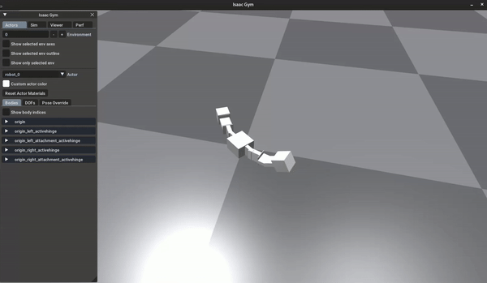
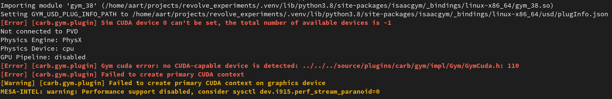

=======================================================================================
Creating a modular robot and simulating and visualizing it in the Isaac Gym environment
=======================================================================================
The final results of this tutorial are available at ``<revolve2_source>/examples/simulate_isaac>``.

-------------------
What you will learn
-------------------

* How to create a ``modular robot``.
* How to use the ``Isaac Gym environment``.

-------------
Prerequisites
-------------

* Have Revolve2 :ref:`installed <installation/index:Installation>`.
* Have the supplementary package ``Isaac Gym environment`` :ref:`installed <installation/runners/isaacgym:Isaac Gym physics runner>`.
* Knowledge of the modular robots used in Revolve2.
* Superficial knowledge of the cpg controllers used in Revolve2.
* A screen. You will visualize the robot.

------------
Introduction
------------
You will hand design a modular robot body, generate a random controller for its brain, and simulate it in the Isaac Gym environment.

--------------
Programming it
--------------
Start by creating a file called ``main.py``. For this tutorial, this is the only file you will need. The Isaac Gym environment uses ``async`` functions, so create an async main.
Also add a random object. You will use that later::

    from random import Random

    # ...

    async def main() -> None:
        # random number generator
        rng = Random()
        rng.seed(5)

    if __name__ == "__main__":
        import asyncio

        asyncio.run(main())
        
The first new thing you will do is create a modular robot body.
A body is described as a tree structure, with the ``Core`` of robot being the root node.
You can add any number of ``Brick`` and ``ActiveHinge`` modules to the tree::

    from revolve2.core.modular_robot import Body, Brick, ActiveHinge
    import math

    # ...

    async def main() -> None:
        # ...

        body = Body()
        body.core.left = ActiveHinge(math.pi / 2.0)
        body.core.left.attachment = ActiveHinge(math.pi / 2.0)
        body.core.left.attachment.attachment = Brick(0.0)
        body.core.right = ActiveHinge(math.pi / 2.0)
        body.core.right.attachment = ActiveHinge(math.pi / 2.0)
        body.core.right.attachment.attachment = Brick(0.0)
        body.finalize()

For simplicity this tutorial presents you with a CPG controller that uses random generated weights.
If you wish to control the weights, take a look at the ``CpgRandom`` class and create a similar controller yourself.
Using the brain and body, create a ``ModularRobot``::

    from revolve2.core.modular_robot.brains import CpgRandom
    from revolve2.core.modular_robot import ModularRobot

    # ...

    async def main() -> None:
        # ...

        brain = CpgRandom(rng)
        robot = ModularRobot(body, brain)

To simulate the robot, create a ``Simulator`` class::

    # ...

    class Simulator:
        async def simulate(self, robot: ModularRobot, control_frequency: float) -> None:
            raise NotImplementedError()

    async def main() -> None:
        # ...

        sim = Simulator()
        await sim.simulate(robot, 60)

A physics simulation environment such as the Isaac Gym environment works with batches of environments.
A batch provides common arguments between all environments, and an environment describes the physical Actors to be simulated in that environment.
Environments do not interact with each other.
Create batch and a single environment for our lone robot to be simulated.
Also create a control function that controls all robots in each environment.
Control frequency determines how often this control function is called.
Sampling frequency is not relevant for this tutorial, but controls how much information about the simulation is saved::

    from revolve2.core.physics.env import Batch, Environment, ActorControl

    # ...

    async def simulate(self, robot: ModularRobot, control_frequency: float) -> None:
        batch = Batch(
            simulation_time=1000000,
            sampling_frequency=0.0001,
            control_frequency=control_frequency,
            control=self._control,
        )
        env = Environment()

    def _control(self, environment_index: int, dt: float, control: ActorControl) -> None:
        raise NotImplementedError()

Next, get the actor and controller from the modular robot and save the controller as a class variable for later.
An actor is the physical description of the robots.
That is, it is a collection of rigid bodies and the joints connecting them.
A controller is the brain that drives these joints::

    from revolve2.core.physics.control import ActorController

    # ...

    class Simulator:
        _controller: ActorController

        async def simulate(self, robot: ModularRobot, control_frequency: float) -> None:
            # ...

            actor, self._controller = robot.make_actor_and_controller()

Add the robot to the environment just above the ground, add the environment to the batch, and run the batch.
It is possible to run the simulation in headless mode(no graphics) by passing the ``headless`` parameter to ``LocalRunner``.::

    from revolve2.core.physics.env import PosedActor
    from pyrr import Vector3, Quaternion
    from revolve2.runners.isaacgym import LocalRunner

    # ...

    async def simulate(self, robot: ModularRobot, control_frequency: float) -> None:
        # ...

        env.actors.append(PosedActor(actor, Vector3([0.0, 0.0, 0.1]), Quaternion(), [0.0 for _ in self._controller.get_dof_targets()],))
        batch.environments.append(env)

        runner = LocalRunner()
        await runner.run_batch(batch)

Finally, implement the control function, using the controller retrieved from the modular robot earlier.
Modular robots provide a controller that you can use to drive that individual robot.
If there is more than one robot, you need to store each individual controller::

    def _control(self, dt: float, control: ActorControl) -> None:
        self._controller.step(dt)
        control.set_dof_targets(0, self._controller.get_dof_targets())

----------------------------
Running and expected results
----------------------------
You should now be able to successfully run the simulation and see a two armed robot attempt to move around.

The exact class you just created is also readily available at ``revolve2.analysis.isaacgym.ModularRobotRerunner``.

------
Errors
------
If you do not have an Nvidia graphics card, you can expect the console out put to look like the image below.
This is no issue.

For both with and without an Nvidia graphics card the simulation can fail if you do not have Cuda installed, even though it is not used at all when running on CPU.

------------
Contributing
------------
This marks the end of this tutorial. Feedback and contributions are welcome at Revolve2's code repository.
